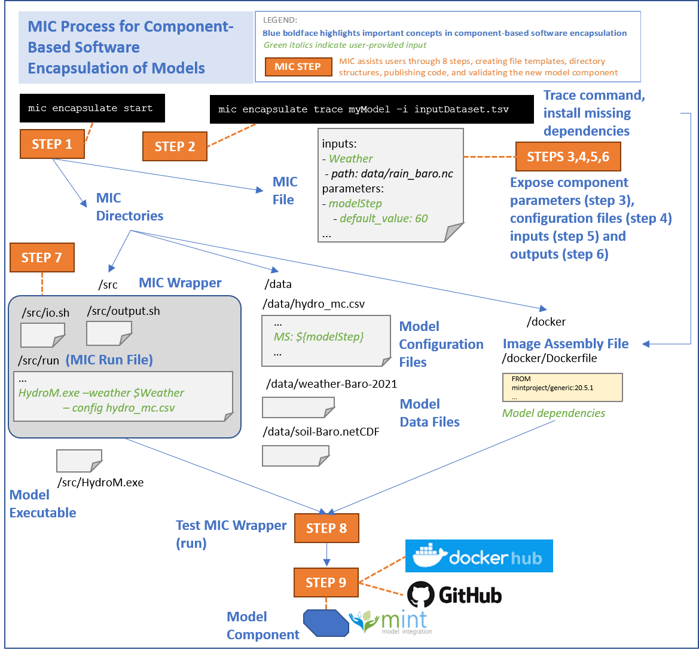

Model Insertion command-line interface (MIC) is an application to assist modelers for adding through the steps required for encapsulating your model component and exposing a set of inputs and parameters of interest so they can be added on a Model Catalog Service.

In addition, MIC also allows describing basic model metadata such as model version, model configuration, parameters, inputs, outputs, authors and contributors.

MIC has been tested in OSX, Linux and Windows. It is installed through a simple pip command.

!!! info
    MIC is an ALPHA version, which we are still testing and developing continuously. If you find an error or experience any issue, please report them [here](https://github.com/mintproject/mic/issues/new/choose).

## What is a model components

Encapsulating software into components allows other users to easily access and run software in their own environments.  Following well-established component-based software engineering principles, we want to create self-contained software components that only reveal functionality that is of interest to third parties. This is important because models are often implemented in large software packages or libraries that contain many tools and functions to run the model in many different ways, to prepare data, to visualize data, etc.  It is hard to navigate all the possible functions, especially for those who are interested in sophisticated functionality that may be hard to achieve.  Other models have graphical user interfaces that are convenient to use, but cannot be used for invoking the model from another program.  A user interface button to run a model would call a specific function of the model software, and that function (sometimes called a *command line invocation*, or *invocation function*) is what we want to capture.  That function is known as the *component interface*, and its inputs can be provided when invoking the component but all other data or parameters will be pre-set and internal to the component so none will be able to change them.  Finally, for reproducibility reasons, we want to be able to record how a model execution was set up, which means having an explicit description of the specific function call that was used to run the model.  These issues are addressed by encapsulating software.

A **model component** corresponds to a single invocation function for model software.  From a sophisticated model software package, a model component could be created to include only certain model processes and variables while excluding others. For example, from a hydrology model software package we could create a component for arid zones that includes infiltration processes but not snowmelt processes from the package.  The invocation function for that configuration could have as input the recharge rates.   

## How MIC Works

MIC guides you to create a model component and uploading it to the MINT Model Catalog so it is available to others in 9 simple steps.

Below is an overview of the different steps in MIC.



## Requirements

MIC has the following requirements:

1. Python >= 3.6
2. Docker


### Getting Python 3

MIC uses Python. Please, follow the steps bellow to install it:

- [Installation on Linux](https://realpython.com/installing-python/#linux)
- [Installation on Windows](https://realpython.com/installing-python/#windows)
- [Installation on Mac](https://realpython.com/installing-python/#macos-mac-os-x)

### Docker

MIC uses Docker test and run model components.

- [Installation on Linux](https://docs.docker.com/engine/install/)
- [Installation on MacOS](https://docs.docker.com/docker-for-mac/install/)


## Installation

To install MIC, open a terminal and run:

```bash
$ pip install mic
```

You did it! If you want to verify the installation just type:

```bash
$ mic version
```

You should see a message similar to:

```bash
mic v1.0.1
```

## Limitations

Note that MIC has been designed to run Unix-based applications. Windows based applications (e.g., models that execute through an .exe) are not currently supported.

## Development version

If you want to install the latest development version, open a terminal and type:

```bash
$ pip install git+https://github.com/mintproject/mic.git@develop -U
```
Note that the development version may be unstable.

## Issues, Troubleshooting and Feature Requests

Known issues with MIC are listed [here](https://github.com/mintproject/mic/issues).

If you experience any issues when using MIC, or if you would like us to support additional exciting features, please open an issue on our [GitHub repository](https://github.com/mintproject/mic/issues).

## Code Releases and Next Updates

The [latest release of MIC is available in GitHub](https://github.com/mintproject/mic/releases/latest). You can check the issues and updates we are working on for the next releases [here](https://github.com/mintproject/mic/milestones).
