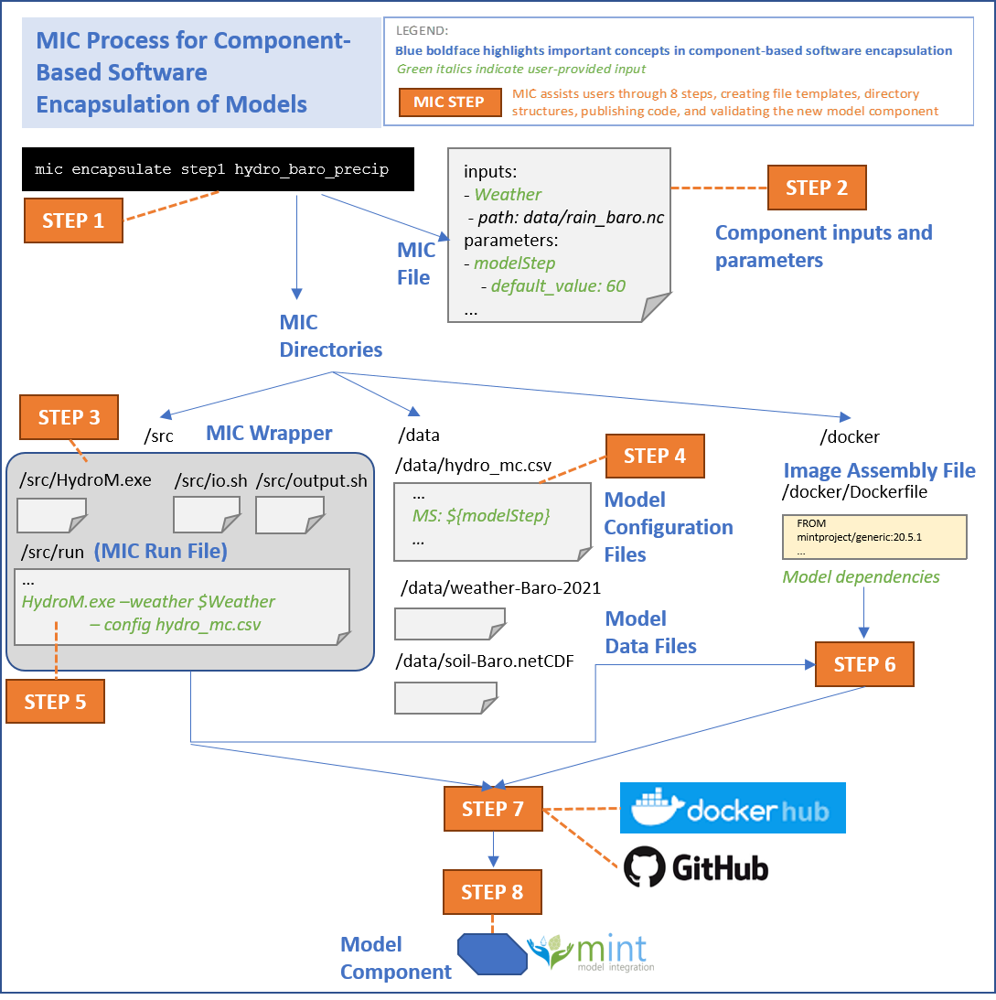

# Creating a Model Component

The `encapsulate` command  in MIC guides you through eight steps to create an executable component that encapsulates your model code and makes it available in the MINT Model Catalog. Once your model is available in the MINT Model Catalog, other users can easily access and run it in their own environments.

There are several reasons for creating a component out of a model:
You will be able to create a simplified version of your model, only exposing the inputs and parameters that are more important for a user.
Everyone will be able to execute your model in their own operating systems using [DAME](dame-cli.readthedocs.io/) (Linux, macOS or Windows) or Docker.
You will be able to create a secure environment for executing your model. This will ensure that your model will work independently of the dependencies installed in the system where your model is executed.
You will be able to browse your component in the [MINT model catalog](https://models.mint.isi.edu/)

Encapsulating software allows other users to easily access and run software in their own environments.  Following well-established component-based software engineering principles, we want to create self-contained software components that encapsulate functionality that is of interest to third parties, for example by other users or by other systems through an API.  This is important because models are often implemented in large software packages or libraries that contain many tools and functions to run the model in many different ways, to prepare data, to visualize data, etc.  It is hard to navigate all the possible functions, especially for those who are interested in sophisticated functionality that may be hard to achieve.  Other models have user interfaces that are convenient to use, but cannot be used for invoking a model from another program.  A user interface button to run a model would call a specific function of the model software, and that function is what we want to capture.  Finally, for reproducibility reasons, we want to be able to record how a model execution was set up, which means having an explicit description of the specific function that was used to run the model.  These issues are addressed by encapsulating software.

A model component corresponds to a single invocation function for model software that makes sophisticated functionality easy for others to invoke and use without having to worry about how it is implemented.  From a sophisticated model software package, a model component could be created to include only certain model processes and variables while excluding others. For example, from a hydrology model software package we could create a component for arid zones that includes infiltration processes but not snowmelt processes from the package.  The invocation function for that configuration could mention recharge rates.   We want the invocation function to be **a command line invocation**, as opposed to a user interface menu selection or button click.  

In preparation for creating a model component, you should consider what functions you would like others to use to invoke your model easily and think of what components you would like to create for them. Then, prepare your model code in a local directory so it can be invoked from a command line, loading data from that directory.  You should also remove any hardcoded paths and other local dependencies, and instead make them explicit by feeding them as parameters or by reading them from a configuration file.  Once you have done this preliminary preparation, MIC can help you create a MINT model component.

Encapsulating a component and uploading it to the MINT Model Catalog is done with MIC.   MIC has an `encapsulate` command that will guide you through several steps in the form of  eight subcommands. Each subcommand represents one of the eight steps to encapsulate your model. The steps should be followed in order, and after each step you will have a chance to check what MIC is doing to help you create your model component.

By typing `mic encapsulate --help`, you will see the following message, listing the steps available:

```bash
Usage: mic encapsulate [OPTIONS] COMMAND [ARGS]...

  Command to encapsulate your model component

Options:
  --help  Show this message and exit.

Commands:
  status  Displays in which step you are in
  step1   Set up a MIC directory structure and MIC file template
  step2   Specify the inputs and parameters of your model component
  step3   Prepare the MIC wrapper for your model component
  step4   Edit your model configuration files 
  step5   Define how to use your component in the command line
  step6   Prepare, build, and run your Docker Image
  step7   Publish your code in GitHub and your image to Dockerhub
  step8   Publish your model component in the MINT Model Catalog
```

If you get lost and you don’t know in which stage of your model component you are,  just type`mic encapsulate status` to see which step you are currently on. If you want to know about the details of any step, just do `mic encapsulate stepY --help`, where `Y` represents a number 1..8.


Creating a MINT model component involves eight major steps. Below is an overview of the different steps and how they interact with each other: 



!!! info
   Currently, **MIC has been tested for steps 1 through 6**. We are testing the functionality for Steps 6, 7 and 8. Some of the steps described here (in particular, steps 3, 4 and 5) will be automated in next MIC releseases. Stay tuned!

### Step 1: Set up a MIC directory structure and MIC file template


Create a *component directory structure* to capture model code and model component data and default parameters. MIC will also create a template MIC file, which will be modified in subsequent steps with information about the model component.

**Expected outcome of this step**: A folder with the name of your model component, containing 3 subfolders (`data`, `src` and `docker`), and a placeholder MIC file that shows up as `mic.yaml` file in that folder.

### Step 2  Specify the component interface for your model component 
Provide MIC with the invocation command’s inputs and parameters that you would like users to have for your model component.  MIC will add this information to the MIC file.

**Expected outcome of this step**: The MIC file will be automatically edited to include information about the input datasets and parameters that you provided for your model component.

### Step 3   Prepare MIC wrapper template for your model component
Create a *component interface wrapper* that indicates how the component interface specification from Step 2 corresponds to the specific invocation command in your model.

**Expected outcome of this step**: MIC will create several files (x y z) are placeholders that will be filled in subsequent steps.  We call these files the MIC Wrapper.

### Step 4   Pre-populate your model configuration files
You will edit your  model configuration files to include the  parameters you included in the component interface. In this step MIC will guide you to edit these files so the parameters that you specified  in your model component interface are appropriately set

**Expected results after completing this step**: MIC will generate a revised MIC file that points to the model configuration files that set the  parameters in the model component interface.

### Step 5   Specify the command line to invoke your model software 
You will edit the “run” file to specify the command line invocation for your model software for this model component.  MIC will automatically create a component image assembly file (Dockerfile) template based on the “run” file you edited in this step, which you can edit to add runtime library dependencies (this will  be automated in future versions).

**Expected results after completing this step**:  There will be an updated “run” file mapping the component interface to the command line. A new file called Dockerfile will contain image assembly instructions.  

### Step 6  Build and test your component image
MIC will build a component  image based on the image assembly file.  MIC will test your component by running that image in your local computer.  You can fix any errors that come up when doing these runs.
**Expected results after completing this step**: If the tests are successful, your component will be executable by others in their own local hosts or servers

### Step 7   Publish your model component implementation
MIC will upload a snapshot of your MIC model wrapper and model software and a snapshot of your model component image in GitHub and DockerHub. 

**Expected results after completing this step**: Your model component wrapper will be archived in Github, and your model component  image in DockerHub. Both will receive a tag and will be versioned so that they are accessible by anyone anywhere.

### Step 8   Publish your model component in MINT
MIC will create an entry for your model component to the MINT Model Catalog, which will make it accessible by others through MINT services and interfaces to be run in their own local hosts and servers

**Expected results after completing this step**: MINT will have an entry for your model configuration in the MINT Model Catalog, and anyone using DAME can easily access and run it.
