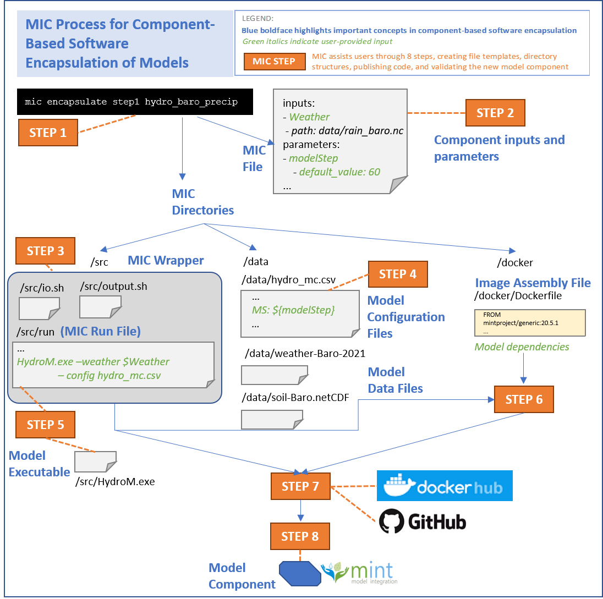

# Creating a Model Component

The `encapsulate` command  in MIC guides you through eight steps to create a model component that encapsulates your model code and makes it available in MINT so others can easily run it in their own local environments.  To accomplish this, MIC relies on state-of-the-art virtualization tools (including Docker), software engineering best practices, and semantic reasoning for validation.

There are several reasons for creating a model components:
* You will be able to expose only the inputs and parameters that are more important for a particular use of the model, pre-setting the rest and making them internal to the model component and inaccessible to other users.
* You will be able to create a secure environment for executing the model. When others want to run your model, they will be reassured that the model will not disrupt or delete anything in their local environment.
* Everyone will be able to find your component in the [MINT model catalog](https://models.mint.isi.edu/) using [DAME](dame-cli.readthedocs.io/).  
* Everyone will be able to execute your model in their own local environments and operating systems (Linux, macOS or Windows).


##  What is a Model Component

Encapsulating software into components allows other users to easily access and run software in their own environments.  Following well-established component-based software engineering principles, we want to create self-contained software components that only reveal functionality that is of interest to third parties.  This is important because models are often implemented in large software packages or libraries that contain many tools and functions to run the model in many different ways, to prepare data, to visualize data, etc.  It is hard to navigate all the possible functions, especially for those who are interested in sophisticated functionality that may be hard to achieve.  Other models have graphical user interfaces that are convenient to use, but cannot be used for invoking the model from another program.  A user interface button to run a model would call a specific function of the model software, and that function (sometimes called a *command line invocation*, or *invocation function*) is what we want to capture.  That function is known as the *component interface*, and its inputs can be provided when invoking the component but all other data or parameters will be pre-set and internal to the component so noone will be able to change them.  Finally, for reproducibility reasons, we want to be able to record how a model execution was set up, which means having an explicit description of the specific function call that was used to run the model.  These issues are addressed by encapsulating software.

A **model component** corresponds to a single invocation function for model software.  From a sophisticated model software package, a model component could be created to include only certain model processes and variables while excluding others. For example, from a hydrology model software package we could create a component for arid zones that includes infiltration processes but not snowmelt processes from the package.  The invocation function for that configuration could have as input the recharge rates.     


## Getting Started

In preparation for creating a model component, you should consider what set of functions you would like others to use to run your model.  For each function, think about what parameters you would like to preset and which ones you would want them to easily change through the function call. 

Prepare your model code in a local directory so it can be invoked from a command line, and loading any input data and configuration files from that directory.  You should remove any hardcoded paths and other local dependencies, and instead make them explicit by reading them from a configuration file.  Once you have done this preliminary preparation, MIC can help you create a model component.

## How MIC Works

MIC guides you to create a model component and uploading it to the MINT Model Catalog so it is available to others.   This involves eight major steps. MIC has an `encapsulate` command that will guide you through those steps in the form of eight subcommands. Each subcommand represents one of the eight steps to encapsulate your model. The steps should be followed in order, and after each step you will have a chance to check what MIC is doing to help you create your model component.  

MIC creates: 1) a MIC Directory, 2) a MIC File, 3) a MIC Wrapper, 4) a component virtualization image, 5) archival versions of your model code, MIC directories and files, and image in GitHub and DockerHub, and 6) a model component entry in the MINT Model Catalog.

Below is an overview of the different steps in MIC. 



### Step 1: Set up a MIC directory structure and MIC file template
Create a *MIC directory* and a template *MIC file* that will be modified in subsequent steps with information about the model component.

**Expected outcomes of this step**: A folder with the name of your model component, containing 3 subfolders (`data`, `src` and `docker`), and a placeholder MIC file that shows up as `mic.yaml` file in that folder.

### Step 2  Specify the component inputs
Specify the input data and parameters that you would like users to provide for your model component.  This information will be added to the MIC file.

**Expected outcome of this step**: The MIC file will be automatically edited to include information about the input datasets and parameters that you specified for your model component.

### Step 3   Prepare MIC wrapper template
Create a *MIC wrapper* that indicates how the component invocation from Step 2 corresponds to the functions implemented in your model software.

**Expected outcome of this step**: The MIC Wrapper will be automatically set up consisting of three files (run, io.sh, and output.sh) that are placeholders to be filled in subsequent steps. They can be found in the /src folder of the MIC directory.

### Step 4   Pre-populate the model configuration files
You will edit your model configuration files to include any new parameters that you specified as component inputs. In this step MIC will guide you to edit these configuration files so those parameters are appropriately set.

**Expected results after completing this step**: MIC will update the MIC file with pointers to the model configuration files that set the parameters that are input to your component.

### Step 5   Specify the invocation command to run your model software 
You will edit the MIC Wrapper's “run” file to add the command line invocation for your model software for this model component.  Based on that "run" file, MIC will automatically create a component image assembly file (Dockerfile) template, which you can edit to add runtime library dependencies (NOTE: this will be automated in future versions).

**Expected results after completing this step**:  There will be an updated MIC Wrapper's “run” file mapping the component inputs to the invocation command of your model software. MIC will automatically create a new file called Dockerfile that will contain image assembly instructions for Docker.

### Step 6  Build and test your component virtualization image
MIC will automatically build a component virtualization image based on the component image assembly file.  MIC will test your component by running that image in your local computer.  It will show you any errors that come up so you can fix them.

**Expected results after completing this step**: If the tests are successful, the encapsulation of your model component has been successful.

### Step 7   Publish the model component software and image
MIC will upload the MIC Wrapper and your model software in GitHub.  MIC will also upload the model component image in DockerHub. This will give them unique identifiers that represent the snapshot of the model that you wanted to encapsulate so that any future updates to your model or your model component can be distinct from each other.

**Expected results after completing this step**: Your model component wrapper will be uploaded to Github, and your model component image to DockerHub. Both will receive a tag and will be versioned, and will be archived so they are available to anyone anywhere.

### Step 8   Publish the model component in MINT
MIC will create an entry for your model component to the MINT Model Catalog, which will make it accessible by others through MINT services and interfaces to be run in their own local hosts and servers.

**Expected results after completing this step**: MINT will have an entry for your model component in the MINT Model Catalog.  Anyone using DAME can easily run your component with their own data.  Anyone using MINT can run your component with any dataset in MINT.

## Using MIC to Create Model Components

Once you have MIC installed, you can type `mic encapsulate --help` to see the following message that lists all the steps:

```bash
Usage: mic encapsulate [OPTIONS] COMMAND [ARGS]...

  Command to encapsulate your model component

Options:
  --help  Show this message and exit.

Subcommands:
  status  Displays the next step you need to complete
  step1   Set up a MIC Directory and MIC File
  step2   Specify the component inputs
  step3   Prepare the MIC Wrapper
  step4   Pre-populate the model configuration files 
  step5   Define the command line to run the mode component
  step6   Build and test your component virtualization image
  step7   Publish the model component software and image
  step8   Publish the model component in MINT
```

Type `mic encapsulate stepN` to get started with a step.  You have to do them in order.

If you don’t remember which step you need to do next, just type`mic encapsulate status`. If you want to know more about a specific step, just do `mic encapsulate stepN --help`, where `N` represents a number 1..8.

!!! info
    Currently, **MIC has been tested for steps 1 through 6**. We are testing the functionality for Steps 6, 7 and 8. Some of the steps described here (in particular, steps 3, 4 and 5) will be automated in next MIC releseases. Stay tuned!


