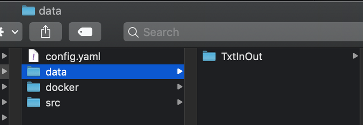

## Step 2:  Specify the inputs and parameters of your model component

This step will help you describe the inputs data and parameters required to execute your model component. All inputs and parameters will be added by MIC in the MIC file.

First, you must copy your inputs/data to the data directory.

A data/input can be:
A file
A directory with multiple files or directories inside (in this case, MIC will create a zip file in your model component).
For example, let’s assume a model that has its inputs for a particular region on the `TxtInOut` directory. Therefore, we copy the directory `TxtInOut` into the `data` folder:



Next, we must define the parameters to expose in your model component.
These parameters are important because we may not be interested in exposing the full complexity of our model. For example, if we have prepared a model to execute in a particular region and we have tweaked certain parameters (e.g., soil porosity), we may not want these changed by the researchers or analysts using our model. However, we may want them to be able to change other parameters (e.g., increments in precipitation) to generate interesting simulations. This way, analysts or researchers can explore indicators values under different initial conditions, without needing to worry about complex model calibration details.

A parameter can be a string, float, integer, or boolean.

##### How to perform this step?

You must type the following:

```bash
$ mic encapsulate step2 [OPTIONS]
Options:
  -p, --parameters INTEGER    [required]
  -f, --mic_file FILE
  --help                      Show this message and exit.
```

The command has two options:
-p, --parameters: The number of parameters
-f, --mic_file: A path to the MIC file. By default, the value is: `mic.yaml

!!! info
    The flags `-f` or `--mic_file` are equivalent.


!!! info
   The MIC file is under your Model Component directory.

For example let’s consider we want to create a component for the [SWAT hydrology model](https://swat.tamu.edu/), where we would like to expose two parameters:

start_year: When the simulation starts.
years: Number of years to simulate.

We have already executed step1, and we have created the structure for our model component `swat_precipitation_rates`. To perform step2, we would type:

```bash
$ mic encapsulate step2 -f swat_precipitation_rates/mic.yaml -p 2
```
If you move to the folder where the mic.yaml file is located, you can  avoid having the option `-f`, as MIC will automatically scan for this file:

```bash
$ cd swat_precipitation_rates
$ mic encapsulate step2 -p 2
Searching files in the directory /Users/mosorio/tmp/swat_precipitation_rates/data
MIC has added the parameters and inputs into the MIC file
You can see the changes /Users/mosorio/tmp/swat_precipitation_rates/mic.yaml
```

### Expected result:

MIC should have updated the MIC file (mic.yaml).
Each input has the path to the right file or directory
Each parameter has a default value equals to zero

In the SWAT example, the content of the file is:

```yaml
inputs:
  txtinout:
    path: data/TxtInOut
parameters:
  parameter1:
    default_value: 0
  parameter2:
    default_value: 0
step: 2
```

You must add a *default_value* for each parameter.
You can edit the name of the parameters and inputs (Spaces are not admitted)
For the SWAT example, we modified the name of the parameters and the default_value
```
inputs:
  txtinout:
    path: data/TxtInOut
parameters:
  start_year:
    default_value: 1991
  years:
    default_value: 2
step: 2
```

In step 3, we will use the parameter names to set up your model component.


#### Help command

```bash
mic encapsulate step2 --help                                
Usage: mic encapsulate step2 [OPTIONS]

This step describes the inputs/data and parameters of your Model Component.

The command has two options:
-p, --parameters: The number of parameters
-f, --mic_file: By default, the value is: `mic.yaml

This information will be written in the MIC file.
You can edit the name of the inputs/data and parameters and the default_value of the parameters

  mic encapsulate step2 -f <mic_file> -p <number_of_parameters>

Options:
  -p, --parameters INTEGER    [required]
  -f, --mic_file FILE
  --help                      Show this message and exit.

```


