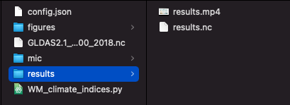

!!! warning
    DO NOT CLOSE the terminal in-between each step.  
    After inspecting the `mic.yml` file in-between steps, CLOSE the file.

In this step, MIC will trace the execution of your component to make sure it captures all its implicit file dependencies and its invocation command. First, you will have to make sure your software is being executed in the environment prepared by MIC, and then you will have to trace its execution.

## Testing your model in the execution environment prepared by MIC

The `mic pkg start` command created a blank execution environment that is independent of the installed dependencies of your computer; and mounted the folder you chose. In our Python example, we have a folder with an executable (WM_climate_indices.py), an input file (GLDAS2.1_TP_2000_2018.nc), and the config file used to set the parameters for the model:


The next step is to ensure our software works in this execution environment, and otherwise install all missing dependencies. In our case, we run the Python executable:

```bash
$ root@32fee4e4d205:/tmp/mint# python3 WM_climate_indices.py config.json
Done
```
Two outputs folder were created as a result of the execution: `figures` and `results`, which are expected from this software. In this case, the `results` folder contains the relevant results for a user.



In this case, MIC used an already prepared image. Other dependencies can be added along the way through `pip` or `conda`.

Once you have tested your software, you actual step is to trace its execution.

## How to perform this step?

Within the contained image, type:

```bash
$ mic pkg trace <your_execution_command>
```

Where `<your_execution_command>` corresponds to the way you would invoke your model, exactly as you would like to expose it.

In the case above:

```bash
$ (climate) root@d8826beb2c59:/tmp/mint# mic pkg trace python3 WM_climate_indices.py config.json
```

**What does this do?** MIC uses [Reprozip](https://www.reprozip.org/), a program to track all the system calls of your model, to automatically track down all the file and dependencies being used. The result is saved in a file called `.reprozip-trace`, which we will call `trace` for simplicity.

If multiple commands are required for your model execution, trace each of them separately (or create a script including them and trace the invocation of the script). If you are capturing multiple traces, you will see a message like this one:

```bash
Trace directory .reprozip-trace exists
(a)ppend run to the trace, (d)elete it or (s)top? [a/d/s]
```
'`a`' will add the command to the existing trace; '`d`' will delete previous traces and create a new one with the new command and '`s`' will stop the tracing process.

## Expected result:

Your model component will take longer to run; at at the end you should see a long log message on the screen. The ending of this message should be similar to:

```bash
Configuration file written in .reprozip-trace/config.yml
Edit that file then run the packer -- use 'reprozip pack -h' for help
```
A new folder called `.reprozip-trace` will have been created in your directory:


If you are curious, you may open the `config.yaml` file inside `.reprozip-trace` folder, but no manipulation is required and you may proceed to the next step.

!!! warning
    After inspecting the `mic.yml` file in-between steps, CLOSE the file.


Note that `.reprozip-trace` is a hidden folder and you may need to enable this view on your computer.

## Help command

```bash
Usage: mic pkg trace [OPTIONS] [COMMAND]...

  Complete the mic.yaml file with the information of the parameters and
  inputs you want to expose

  MIC is going to automatically detect:  - All inputs (files and
  directories) used by your component and add them in the mic.yaml file.  -
  All parameters used by your component and add them in the configuration
  file

  Usage example: mic pkg trace python main.py
  ./your_program

Options:
  --continue   add to the previous trace, don't replace it
  --overwrite  overwrite the previous trace, don't add to it
  --help       Show this message and exit.
```
