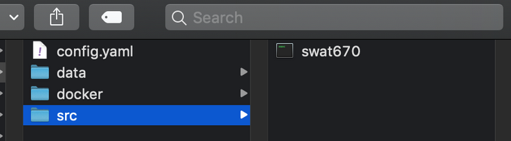
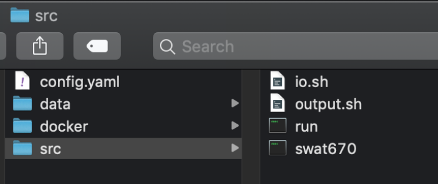
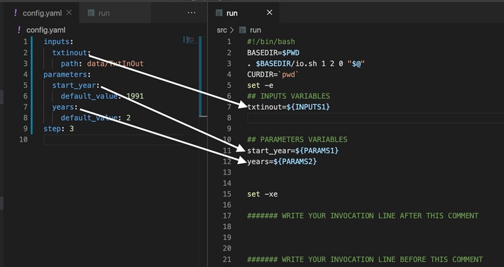

## Step 3: Prepare the code to run your model component 

[Skip background explanation](#how-to-perform-this-step)

### Step 3.1 Copy your scripts into the src folder

First, you must copy any scripts you want to incorporate into your model component into the src directory. **You don’t need to copy any installed dependencies in your computer**. For example, if you have a script that you use to initialize your model, or a script that you use to create visualizations of your model and you want these visualizations to be part of your component, copy them as well. If you just invoke your model through the command line with no scripts, then no further action is required.

Following our SWAT example described in previous steps, we had a `swat670` executable that we need to make the model run (it’s not an installed dependency). Therefore, we  copy the executable `sawt670` into the src folder. If our model was invoked through an R/python script, we would only need to copy those scripts in the src folder.  The result would look as follows: 



Next, we are going to generate the MINT Wrapper

### Step 3.2: Generate the MINT Wrapper.

The MINT Wrapper is a plain text file that contains a series of commands needed for executing a model.
The MINT Wrapper does the following tasks:
Copy and extract your inputs in the src directory
Feed the parameter values to your models.
Detect errors on execution time.

The commands in the MINT Wrapper are a mixture of commands we would normally type ourselves on the command line (such as ls or cp). If this sequence of commands is needed to execute your model, we need to preserve it in your model component. Remember that anything you can run normally on the command line can be put into a script with equivalent functionality. 
!!! info
    Many models have graphical interfaces for data preparation purposes and set up. However, the scope of this effort is making your model available on any infrastructure. Cloud servers and supercomputers don’t usually provide graphical interfaces, and therefore we cannot assume a graphical interface to be available. It is a good engineering practice to deliver a component that can be used without a graphical interface.

### How to perform this step?

```
mic encapsulate step3 [OPTIONS]
Options:
  -f, --mic_file FILE      a path to the MIC file 
  --help                      Show this message and exit.
```

For example, in SWAT, we run the command using the MIC configure file:

```bash
$ mic encapsulate step3 -f swat_precipitation_rates/config.yaml
```


### Expected results

If everything runs correctly, MIC will create:
MINT Wrapper: available in src/run
Two internal files (io.sh and output.sh) that you must not modify. These files are auxiliary for MIC.



The MINT Wrapper matches each input and parameter to a variable. 



This is useful because now you can modify the parameters of your model configuration. In the next step we will cover how to feed parameters to a model in the case where the model uses custom configuration files.
