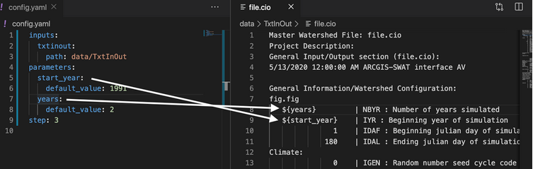

# Step 4: Edit your model configuration files

Models tend to be complex, and it becomes impractical to configure their parameters through the command line. Instead, many models define their parameters in one or multiple configuration files.

In our SWAT example used in previous steps, we defined two parameters related to the start year of the simulation and the number of years to run it:

```yaml
inputs:
  txtinout:
    path: data/TxtInOut
parameters:
  start_year:
    default_value: 1991
  years:
    default_value: 10
step: 2
```

These parameters should change the values in one of the SWAT configuration files, namely `file.cio`, which defines these parameters among others. In our example, we can find this file in the TxtInOut directory we used as input: `data/TxtInOut/file.cio`. The file looks as follows: 

```
Master Watershed File: file.cio
Project Description:
General Input/Output section (file.cio):
5/13/2020 12:00:00 AM ARCGIS-SWAT interface AV

General Information/Watershed Configuration:
fig.fig
        1    | NBYR : Number of years simulated
        1993    | IYR : Beginning year of simulation
               1    | IDAF : Beginning julian day of simulation
             180    | IDAL : Ending julian day of simulation
```
As shown above, the parameters NBYR and IYR correspond to `years` and `start_year` respectively. In the following steps we will cover how to map these values into .


### How to feed parameters in configuration files?

The MINT wrapper can replace the values of the parameters in their right configuration files, but it needs to know where they are. Therefore, we need to define **placeholders** in the configuration files stating which value will be replaced.

In the SWAT example, we opened the `file.cio` configuration file and replaces:
 the value `2` with  ${years}
the value `1991` with ${start_year}

The result would look as follows:

```
Master Watershed File: file.cio
Project Description:
General Input/Output section (file.cio):
5/13/2020 12:00:00 AM ARCGIS-SWAT interface AV

General Information/Watershed Configuration:
fig.fig
         ${years} | NBYR : Number of years simulated
   ${start_year}    | IYR : Beginning year of simulation
               1    | IDAF : Beginning julian day of simulation
             180    | IDAL : Ending julian day of simulation
```

Make sure that the names of the parameters match with the names we described in step2! Otherwise mic will not be able to replace the values accordingly:




Once the mapping has been completed, we just need to add the file as a configuration file of the model component:

```bash
mic encapsulate step4 -f mic.yaml [configuration_files]...
```
(Note that `-f mic.yaml` is not needed if you are in the directory where the `mic.yaml` file exists)

In the example, we must run
```
$ mic encapsulate step4 data/TxtInOut/file.cio                                                                      х INT Py mic
Added: data/TxtInOut/file.cio as a configuration file
```

### Expected results 

If everything goes well, the `mic.yaml` will have been updated with a new field named `configs`:

```yaml
inputs:
  txtinout:
    path: data/TxtInOut
parameters:
  start_year:
    default_value: 1991
  years:
    default_value: 10
step: 4
configs:
- data/TxtInOut/file.cio
```
