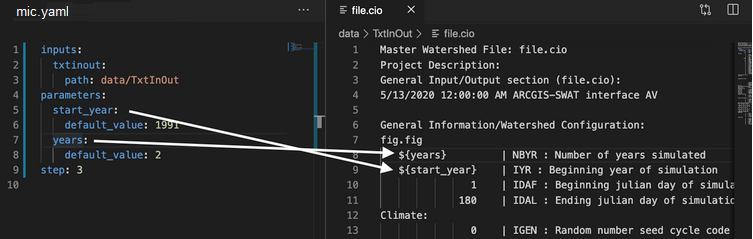

[Skip background explanation](#how-to-perform-this-step)

Models tend to be complex, and it becomes impractical to configure their parameters through the command line. Instead, many models define their parameters in one or multiple configuration files.

Let us consider an example of a complex hydrological model ([SWAT hydrology model](https://swat.tamu.edu/)), which uses a folder with multiple inputs, including a configuration file. We would like to expose 2 parameters from this file, related to the start year of the simulation and the number of years to run it. Our `mic.yaml` file looks as follows:

```yaml
inputs:
  txtinout:
    path: data/TxtInOut
parameters:
  start_year:
    default_value: 1991
  years:
    default_value: 10
```

These parameters should change the values in one of the SWAT configuration files, namely `file.cio`, which defines these parameters among others. In our example, we can find this file in the TxtInOut directory we used as input: `data/TxtInOut/file.cio`. The file looks as follows: 

```
Master Watershed File: file.cio
Project Description:
General Input/Output section (file.cio):
5/13/2020 12:00:00 AM ARCGIS-SWAT interface AV

General Information/Watershed Configuration:
fig.fig
        1    | NBYR : Number of years simulated
        1993 | IYR : Beginning year of simulation
        1    | IDAF : Beginning julian day of simulation
        180  | IDAL : Ending julian day of simulation
```
As shown above, the parameters NBYR and IYR correspond to `years` and `start_year` respectively. In the following steps we will cover how to map these values into .


### How to feed parameters in configuration files?

The MINT wrapper can replace the values of the parameters in their right configuration files, but it needs to know where they are. Therefore, we need to define **placeholders** in the configuration files stating which value will be replaced.

In the SWAT example, we opened the `file.cio` configuration file and replaces:
 the value `2` with  ${years}
the value `1991` with ${start_year}

The result would look as follows:

```
Master Watershed File: file.cio
Project Description:
General Input/Output section (file.cio):
5/13/2020 12:00:00 AM ARCGIS-SWAT interface AV

General Information/Watershed Configuration:
fig.fig
         ${years}         | NBYR : Number of years simulated
         ${start_year}    | IYR : Beginning year of simulation
               1          | IDAF : Beginning julian day of simulation
             180          | IDAL : Ending julian day of simulation
```

Make sure that the names of the parameters match with the names we described in step2! Otherwise mic will not be able to replace the values accordingly:




### How to perform this step?

Once the mapping has been completed, we just need to add the file as a configuration file of the model component:

```bash
mic encapsulate configs [configuration_files]...
```

In the example, we must run
```
$ mic encapsulate configs data/TxtInOut/file.cio
Added: data/TxtInOut/file.cio as a configuration file
```

!!! info
    The `-a` option will automatically recognize any parameter under `${parameter_name}` in the configuration files and add it to the mic.yaml file automatically. This way you can change them directly without having to perform the mapping yourself

### Expected results 

If everything goes well, the `mic.yaml` will have been updated with a new field named `configs`:

```yaml
inputs:
  txtinout:
    path: data/TxtInOut
parameters:
  start_year:
    default_value: 1991
  years:
    default_value: 10
step: 4
configs:
- data/TxtInOut/file.cio
```

### Help command

```bash
Usage: mic encapsulate configs [OPTIONS] CONFIGURATION_FILES...

  Note: If your model does not use configuration files, you can skip this
  step

  Specify which parameters of your model component you want to expose from
  any configuration file.

  - You must pass the MIC_FILE (mic.yaml) as an argument using the (-f)
  option or run the command from the same directory as mic.yaml

  - Pass your model configuration files as arguments

  mic encapsulate configs -f <mic_file> [configuration_files]...

  If you have manually changed some parameters, the -a option will attempt
  to recognize the configuration files automatically

  Example:

  mic encapsulate configs -f mic.yaml data/example_dir/file1.txt
  data/file2.txt

Options:
  -f, --mic_file FILE
  -a, --auto_param     Enable automatic detection of parameters
  --help               Show this message and exit.
```