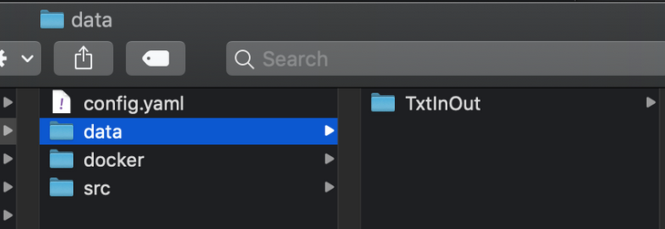

### How to perform this step?


```bash
root@32fee4e4d205:/tmp/mint# mic encapsulate trace --help
Usage: mic encapsulate trace [OPTIONS] [COMMAND]...

  Fill the MIC configuration file with the information about the parameters
  and inputs

  MIC is going to detect:  - the inputs (files and directory) and add them
  in the MIC configuration file.  - the parameters and add them in the
  configuration file

  Example: mic encapsulate trace python main.py mic encapsulate trace
  ./your_program

Options:
  --continue / --overwrite
  --help                    Show this message and exit.
```


Specify the inputs and parameters of your model component

[Skip background explanation](#how-to-perform-this-step)

This step will help you describe the inputs data and parameters required to execute your model component. All inputs and parameters will be added by MIC in the MIC file.

First, you must copy your inputs/data to the data directory.

A data/input can be:
A file
A directory with multiple files or directories inside (in this case, MIC will create a zip file in your model component).
For example, let’s assume a model that has its inputs for a particular region on the `TxtInOut` directory. Therefore, we copy the directory `TxtInOut` into the `data` folder:



!!! warning
    The data to copy in the `data` foder is what MIC will use to **test** your model. It is recommended that you copy in this folder only the data needed as input to run the model.

Next, we must define the parameters to expose in your model component.
These parameters are important because we may not be interested in exposing the full complexity of our model. For example, if we have prepared a model to execute in a particular region and we have tweaked certain parameters (e.g., soil porosity), we may not want these changed by the researchers or analysts using our model. However, we may want them to be able to change other parameters (e.g., increments in precipitation) to generate interesting simulations. This way, analysts or researchers can explore indicators values under different initial conditions, without needing to worry about complex model calibration details.

A parameter can be a string, float, integer, or boolean.

### How to perform this step?

You must type the following:

```bash
$ mic encapsulate step2 [OPTIONS]
Options:
  -p, --parameters INTEGER    [required]
  -f, --mic_file FILE
  --help                      Show this message and exit.
```

The command has two options:
-p, --parameters: The number of parameters
-f, --mic_file: A path to the MIC file. By default, the value is: `mic.yaml`

!!! info
    The MIC file is under your Model Component directory.

For example let’s consider we want to create a component for the [SWAT hydrology model](https://swat.tamu.edu/), where we would like to expose two parameters:

start_year: When the simulation starts.
years: Number of years to simulate.

We have already executed step1, and we have created the structure for our model component `swat_precipitation_rates`. To perform step2, we would type:

```bash
$ mic encapsulate step2 -f swat_precipitation_rates/mic.yaml -p 2
```
If you move to the folder where the mic.yaml file is located, you can  avoid having the option `-f`, as MIC will automatically scan for this file:

```bash
$ cd swat_precipitation_rates
$ mic encapsulate step2 -p 2
Searching files in the directory /Users/mosorio/tmp/swat_precipitation_rates/data
MIC has added the parameters and inputs into the MIC file
You can see the changes /Users/mosorio/tmp/swat_precipitation_rates/mic.yaml
```

### Expected result:

MIC should have updated the MIC file (mic.yaml).
Each input has the path to the right file or directory
Each parameter has a default value equals to zero

In the SWAT example, the content of the file is:

```yaml
inputs:
  txtinout:
    path: data/TxtInOut
parameters:
  parameter1:
    default_value: 0
  parameter2:
    default_value: 0
step: 2
```

You must add a *default_value* for each parameter.
You can edit the name of the parameters and inputs (Spaces are not admitted)
For the SWAT example, we modified the name of the parameters and the default_value
```
inputs:
  txtinout:
    path: data/TxtInOut
parameters:
  start_year:
    default_value: 1991
  years:
    default_value: 2
step: 2
```

In step 3, we will use the parameter names to set up your model component.


In this step, MIC will guide you on how to set up the execution of your model using the command line.

[Skip background explanation](#how-to-perform-this-step)

### Editing the MINT Wrapper file

The MINT Wrapper is a plain text file that contains a series of commands, and we generated it as a result of step 3. These commands are a mixture of commands we would normally type ourselves on the command line (such as ls or cp for example).
Let’s open the MINT Wrapper we generated for SWAT with MIC. 
You can find the MINT Wrapper in the src directory. It’s called `run.sh`:


The MINT wrapper file is going will look similar to this:

```bash
#!/bin/bash
BASEDIR=$PWD
. $BASEDIR/io.sh 1 2 0 "$@"
CURDIR=`pwd`
set -e
## INPUTS VARIABLES
txtinout=${INPUTS1}


## PARAMETERS VARIABLES
parameter1=${PARAMS1}
parameter2=${PARAMS2}


set -xe

####### WRITE YOUR INVOCATION LINE AFTER THIS COMMENT


####### WRITE YOUR INVOCATION LINE BEFORE THIS COMMENT

set -e
cd $BASEDIR
. $BASEDIR/output.sh
```

You must write the commands needed to run your model between the tags: `####### WRITE YOUR INVOCATION LINE BEFORE THIS COMMENT`. In the next section we will provide a few examples on how to achieve this.

## Editing a MINT Wrapper with parameters

Some models read the parameters from the command line. For example, the following model component uses Python to run and feed two parameters (`stats_year` and `years`) to the simulation:

```bash
python3 cycles-wrapper.py --start-year 2010 --years 5
```

In order to have these two parameters configurable through the MIC wrapper, you must replace their value by name of the parameter you gave in the mic.yaml file in the invocation line, as follows:

```bash
python3 cycles-wrapper.py --start-year ${start_date} --years ${years}
```


### Example 2: editing the MIC wrapper with configuration files 
Next, we are going to deal with our SWAT example. In this case the MIC file content is:

```yaml
inputs:
  txtinout:
    path: data/TxtInOut
parameters:
  start_year:
    default_value: 1991
  years:
    default_value: 10
step: 4
configs:
- data/TxtInOut/file.cio
```

The generated MIC wrapper is:
```bash
#!/bin/bash
BASEDIR=$PWD
. $BASEDIR/io.sh 1 2 0 "$@"
CURDIR=`pwd`
set -e
## INPUTS VARIABLES
txtinout=${INPUTS1}


## PARAMETERS VARIABLES
start_year=${PARAMS1}
years=${PARAMS2}


set -xe

####### BEGIN WRITE HOW TO RUN YOUR MODEL


####### END WRITE HOW TO RUN YOUR MODEL
set -e
cd $BASEDIR
. $BASEDIR/output.sh
```
You can see the input variables: `txtinout=${INPUTS1}`. This is the location where the input `txtinout` is located
You can see the parameter variables: `start_years=${PARAMS1}` and `years=${PARAMS2}`

Now, you must write the instructions to execute the model between the lines: 

```
####### WRITE YOUR INVOCATION LINE AFTER THIS COMMENT


####### WRITE YOUR INVOCATION LINE BEFORE THIS COMMENT
```

In order to run the SWAT model, the SWAT binary (the file `swat670` we copied in the src folder previously) must be in the directory `TxtInOut`. Therefore the instructions we add in our MINT wrapper are very simple:

```bash
cd TxtInOut
cp ../swat670 .
./swat670
``` 
Which basically tell MIC to 1) move to the TxtInOut directory; 2) copy the swat670 binary to the TxtInOut; and 3) execute the SWAT binary:


Congratulations! If you reached this point then you are ready to test your model component.

### Preparing the execution

When you have finished the modifications of the MIC Wrapper. You can run step 5.

The step5 is going to:

- Detect if your code is compatible with our environment
- Prepare your Docker Image. A Docker Image is used to encapsulate a software component and the corresponding dependencies. This way you don’t have to start from scratch or install all the software with every new run. It contains **independently deployable** bits of code that can be used to build and run agile applications. It could be anything from a FASTA parser, a tree algorithm, or a simple visualization module.

### How to perform this step?

```
$ mic encapsulate step5                                                   
Dockerfile has been created: /Users/mosorio/tmp/swat_simulation/docker/Dockerfile
```
MIC will create a Dockerfile. Docker can build images automatically by reading the instructions from a Dockerfile. A Dockerfile is a text document that contains all the commands a user could call on the command line to assemble an image. 

In the next release, **MIC is going to extract the dependencies and prepare for Python and Conda environments**. Currently, your Dockerfile will look like:
```
FROM mintproject/generic:20.5.1
```
Which basically prepares a clean linux environment for you to define dependencies. If you want some tips for creating Docker images, check out this [best practices document](https://docs.docker.com/develop/develop-images/dockerfile_best-practices/).

If you have a requirements.txt file with your python dependencies, you just have to extend the docker image with the following (for Python3):

```
COPY requirements.txt /tmp/
RUN pip3 install --requirement /tmp/requirements.txt
```

If you don't know how to create a `requirements.txt` file from your python environment, you just have to type `pip freeze > requirements.txt`. This will capture all the dependencies installed in your current environment. 

### Expected results 
As a result of this step, you will have defined how to invoke your component and created a docker image with the required dependencies to run it. You are very close to the finish line!
