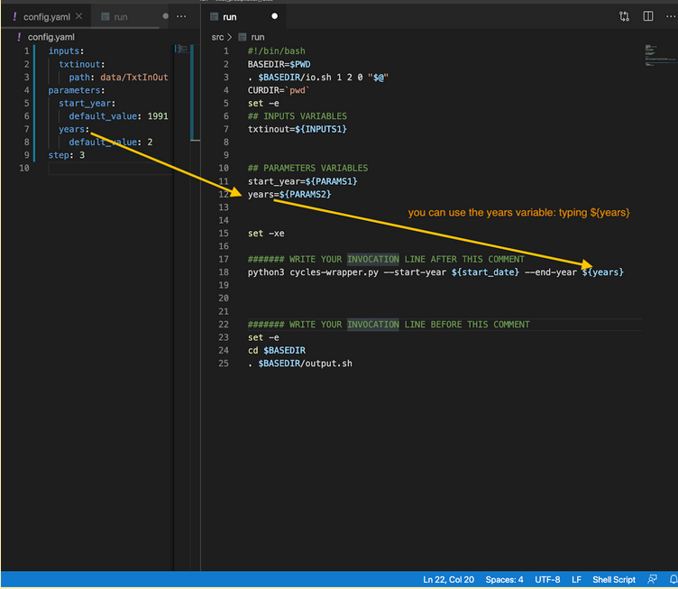

## Step 5: Define how to use your component in the command line

In this step, MIC will guide you on how to set up the execution of your model using the command line.

### Editing the MINT Wrapper file

The MINT Wrapper is a plain text file that contains a series of commands, and we generated it as a result of step 3. These commands are a mixture of commands we would normally type ourselves on the command line (such as ls or cp for example).
Let’s open the MINT Wrapper we generated for SWAT with MIC. 
You can find the MINT Wrapper in the src directory. It’s called `run.sh`:


The MINT wrapper file is going will look similar to this:

```bash
#!/bin/bash
BASEDIR=$PWD
. $BASEDIR/io.sh 1 2 0 "$@"
CURDIR=`pwd`
set -e
## INPUTS VARIABLES
txtinout=${INPUTS1}


## PARAMETERS VARIABLES
parameter1=${PARAMS1}
parameter2=${PARAMS2}


set -xe

####### WRITE YOUR INVOCATION LINE AFTER THIS COMMENT


####### WRITE YOUR INVOCATION LINE BEFORE THIS COMMENT

set -e
cd $BASEDIR
. $BASEDIR/output.sh
```

You must write the commands needed to run your model between the tags: `####### WRITE YOUR INVOCATION LINE BEFORE THIS COMMENT`. In the next section we will provide a few examples on how to achieve this.

## Editing a MINT Wrapper with parameters

Some models read the parameters from the command line. For example, the following model component uses Python to run and feed two parameters (`stats_year` and `years`) to the simulation:

```bash
python3 cycles-wrapper.py --start-year 2010 --years 5
```

In order to have these two parameters configurable through the MIC wrapper, you must replace their value by name of the parameter you gave in the mic.yaml file in the invocation line, as follows:

```bash
python3 cycles-wrapper.py --start-year ${start_date} --years ${years}
```



### Example 2: editing the MIC wrapper with configuration files 
Next, we are going to deal with our SWAT example. In this case the MIC file content is:

```yaml
inputs:
  txtinout:
    path: data/TxtInOut
parameters:
  start_year:
    default_value: 1991
  years:
    default_value: 10
step: 4
configs:
- data/TxtInOut/file.cio
```

The generated MIC wrapper is:
```bash
#!/bin/bash
BASEDIR=$PWD
. $BASEDIR/io.sh 1 2 0 "$@"
CURDIR=`pwd`
set -e
## INPUTS VARIABLES
txtinout=${INPUTS1}


## PARAMETERS VARIABLES
start_year=${PARAMS1}
years=${PARAMS2}


set -xe

####### BEGIN WRITE HOW TO RUN YOUR MODEL


####### END WRITE HOW TO RUN YOUR MODEL
set -e
cd $BASEDIR
. $BASEDIR/output.sh
```
You can see the input variables: `txtinout=${INPUTS1}`. This is the location where the input `txtinout` is located
You can see the parameter variables: `start_years=${PARAMS1}` and `years=${PARAMS2}`

Now, you must write the instructions to execute the model between the lines: 

```
####### WRITE YOUR INVOCATION LINE AFTER THIS COMMENT


####### WRITE YOUR INVOCATION LINE BEFORE THIS COMMENT
```

In order to run the SWAT model, the SWAT binary (the file `swat670` we copied in the src folder previously) must be in the directory `TxtInOut`. Therefore the instructions we add in our MINT wrapper are very simple:

```bash
cd TxtInOut
cp ../swat670 .
./swat670
``` 
Which basically tell MIC to 1) move to the TxtInOut directory; 2) copy the swat670 binary to the TxtInOut; and 3) execute the SWAT binary:


Congratulations! If you reached this point then you are ready to test your model component.

### Preparing the execution

When you have finished the modifications of the MIC Wrapper. You can run step 5.

The step5 is going to:
Detect if your code is compatible with our environment
Prepare your Docker Image. A Docker Image is used to encapsulate a software component and the corresponding dependencies. You don’t start from scratch or install all the software over and over. It contains independently deployable bits of code that can be used to build and run agile applications. It could be anything from a FASTA parser, a tree algorithm, or a simple visualization module.

By typing the following command:
```
$ mic encapsulate step5                                                   
Dockerfile has been created: /Users/mosorio/tmp/swat_simulation/docker/Dockerfile
```
MIC will create a Dockerfile. Docker can build images automatically by reading the instructions from a Dockerfile. A Dockerfile is a text document that contains all the commands a user could call on the command line to assemble an image. 

In the next version, MIC is going to extract the dependencies and prepare for Python and Conda environments. Currently, your Dockerfile will look like:
```
FROM mintproject/generic:20.5.1

```
Which basically prepares a clean linux environment for you to define dependencies. 
### Expected results 
As a result of this step, you will have validated your component and created a draft docker image. You are very close to the finish line!
