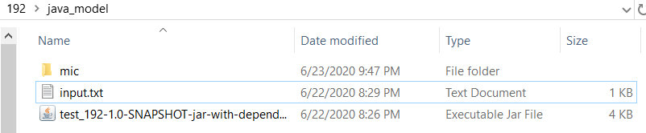

Here we summarize the nine previous steps with the simple Java example executable we have used through the documentation.

Our component takes as input a text file and produces a text file as a result. It has one parameter 'p' which is used by the JAR executable. This is what the component folder looks like after we execute the first MIC command:

The sequence of commands required for encapsulating the model are:

1. Start: `mic pkg start`
2. Trace the execution command: `mic pkg trace java -jar test_192-1.0-SNAPSHOT-jar-with-dependencies.jar -i input.txt -p 1500 -o output.txt`
3. Expose the 'p' parameter with default value 1350: `mic pkg parameters -f mic/mic.yaml -n p -v 1350`.   
4. --Configuration step not necessary because model does not have configuration files--
5. Select inputs to expose: `mic pkg inputs`
6. Select outputs to expose: `mic pkg outputs`
7. Create wrapper: `mic pkg wrapper`. Edit the `run` file to indicate where the parameter `p` needs to be passed on, by replacing it in the invocation command.
8. Run wrapper and verify results: `mic pkg run`
9. Upload: `mic pkg upload`

Done!

