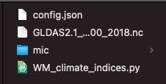

Here we summarize the nine previous steps with the Python example executable we have used through the documentation.

Our component takes as input a netcdf file and produces a netcdf file and a mp4 movie as a result. Parameters are passed through a configuration file. This is what the component folder looks like after we execute the first MIC command:



The sequence of commands required for encapsulating the model are:

1. Start: `mic pkg start`
2. Trace the execution command: `mic pkg trace python3 WM_climate_indices.py config.json`
3. Expose the start/end years of the simulation with default values of 2015 and 2016 respectively:

  - `mic pkg parameters -n sim_start_year -v 2015`
  - `mic pkg parameters -n sim_end_year -v 2016`

4. Edit the configuration file to match the parameters name to their values in the `mic.yaml` file:


5. Select inputs to expose

  - Edit the configuration file to identify which input files should be added:

```json  
{
"data" :
  {
  "dataset_name" : "${input_nc}",
  "dataset_type" : "GLDAS"
},
"output" :
  {
  "dynamic_name" : "False",
  "path" : "./",
  "fig" : "True"
},
"index" :
  {
  "name" : "SPI",
  "distribution" : "gamma",
  "periodicity" : "monthly",
  "scales" : "6",
  "data_start_year" : "${sim_start_year}",
  "data_end_year" : "${sim_end_year}",
  "calibration_start_year" : "2000",
  "calibration_end_year" : "2010"
},
"spatial" :
  {
  "global" : "False",
  "bounding_box": "[23,48,3,15]"
},
"debug" : "False"
}
```
  - `mic pkg inputs`

6. Select outputs to expose: `mic pkg outputs`
7. Create wrapper: `mic pkg wrapper`.
8. Run wrapper and verify results: `mic pkg run`. Once you are done, **exit the MIC environment: Type `exit`**
9. Upload: `mic pkg upload`

Done!
