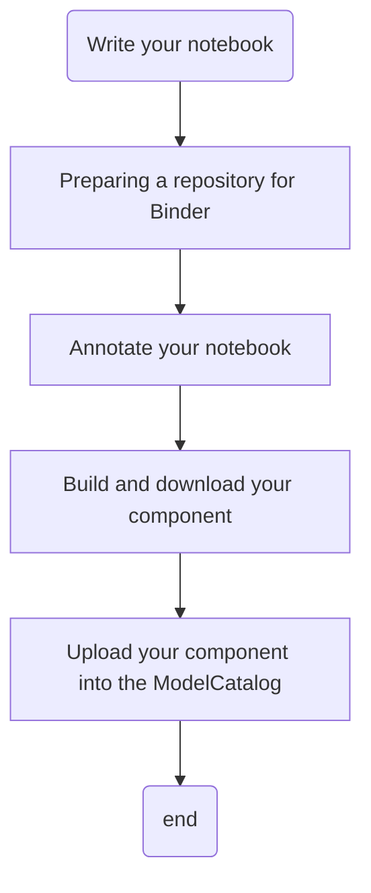

# Adding a Jupyter notebook on MINT

!!! warning
    Works with Python notebooks only




## Preparing a repository for Binder 

### What is Binder Project?

The Binder Project is an open community that makes it possible to create sharable, interactive, reproducible environments. The main technical product that the community creates is called BinderHub, and one deployment of a BinderHub exists at mybinder.org. This website is run by the Binder Project as a public service to make it easy for others to share their work..

### What is a Binder?

A Binder (also called a Binder-ready repository) is a code repository that
contains at least two things:

1. **Code or content that you'd like people to run.** This might be a
Jupyter Notebook that explains an idea, or an R script that makes a
   visualization.
2. **Configuration files for your environment.** These files are used
   by Binder to build the environment needed to run your code.
   For a list of all configuration files available, see the
   [Binder](https://mybinder.readthedocs.io/en/latest/config_files.html#config-files) page.

Configuration files may be placed in the root of
your repository or in a ``binder/`` folder in the repository's root
(i.e. ``myproject/binder/``).

A Binder repository can be built by a BinderHub, which will generate a
link that you can share with others, allowing them to interact with the
content in your repository..


### Preparing a repository for Binder 

In order to prepare your repository for use with the `BinderHub` and `mic` ,all you need to do is ensure that the following conditions are met:


- The repository is in a public location online (e.g., on GitHub or BitBucket)
- The repository does not require any personal or sensitive information (such as passwords)
- The repository has configuration files that specify its environment (see below for an example)
- The repository contains content designed for people to read.

#### A Binder example

For example, let\'s take a look at a simple repository that requires a
few packages in order to run.

##### Explore the repository contents

If we inspect the contents of this repository, we see the following
files:

```bash
./
├── environment.yml
├── index.ipynb
└── README.md
```

In this case, we have two important files:

-   **A content file**: `index.ipynb` is a short Jupyter Notebook that
    generates a plot.
-   **An environment configuration file**: `environment.yml` is a
    standard file that specifies an Anaconda environment.

!!! importart
    You may notice that `environment.yml` is not Binder-specific. This is
    intentional! Binder tries to use environment configuration files that
    are already standards in the data science community. For a list of all
    configuration files available, see the  [Binder](https://mybinder.readthedocs.io/en/latest/using/config_files.html#config-files) page.


## Annotate your notebook

The 
[IPython2CWL](https://ipython2cwl.readthedocs.io/en/stable/) is a tool for converting [IPython](https://ipython.org/) Jupyter Notebooks to
[CWL (Common Workflow Language)](https://www.commonwl.org/) by simply providing typing annotation.


```python
from ipython2cwl.iotypes import CWLFilePathInput, CWLFilePathOutput
import csv
input_filename: 'CWLFilePathInput' = 'data.csv'
result_file: 'CWLFilePathOutput' = 'number_of_lines.txt'
with open(input_filename) as f:
    csv_reader = csv.reader(f)
    data = [line for line in csv_reader]
number_of_lines = len(data)
with open(result_file, 'w') as f:
    f.write(str(number_of_lines))
```

### How it works?

`IPython2CWL` parses each `IPython notebook` and finds the variables with
the typing annotations. For each input variable, the assigment of that
variable will be generalised as a command line argument. Each output
variable will be mapped in the cwl description as an output file.

### Supported types

Each variable can be an input or an output. The basic data types are:

- Inputs:
    - CWLFilePathInput
    - CWLBooleanInput
    - CWLStringInput
    - CWLIntInput
- Outputs:
    - CWLFilePathOutput
    - CWLDumpableFile
    - CWLDumpableBinaryFile


## Build and download your component

Next, let's **build your Binder repository**. Head to
<https://binder.mint.isi.edu>. You\'ll see a form that asks you to specify a
repository for MINT to build. In the first field, paste the URL
of your forked repository. It\'ll look something like this:

``` {.sourceCode .none}
https://github.com/<your-username>/conda
```

Finally, click the **launch** button. This will ask mybinder.org to
build the environment needed to run the repository. You can click on the
\"Build logs\" button to see the logs generated by the build process.

While your Binder repository is building, note the URL that points to
your unique Binder. You can share this URL with a friend, allowing them
to access an interactive version of your repository.

See below for a quick layout of the BinderHub user interface.


If your Binder repository has already been built once, then subsequent
clicks on the Binder link will not re-trigger the build process.
However, if you push any changes to the repository, then it will be
re-built the next time somebody clicks a link.

If your environment files and content files are not housed in the same
branch of the same repository, see the
`external_binder_setup`{.interpreted-text role="ref"} page for how to
generate a URL.

Now that you\'\'re acquainted with Binder, see the
`using-binder`{.interpreted-text role="ref"} page for more information


## Upload the component into the Model Catalog