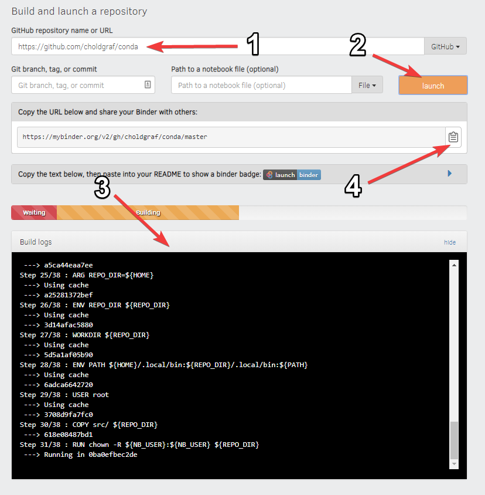

In order to prepare your repository for use with the `BinderHub` ,all you need to do is ensure that the following conditions are met:


- The repository is in a public location online (e.g., on GitHub or BitBucket)
- The repository does not require any personal or sensitive information (such as passwords)
- The repository has configuration files that specify its environment (see below for an example)
- The repository contains content designed for people to read.

#### Example

For example, let's take a look at a simple repository that requires a
few packages in order to run.

##### Explore the repository contents

If we inspect the contents of this repository, we see the following
files:

```bash
./
├── environment.yml
├── simpleModel.ipynb 
└── README.md
```

In this case, we have two important files:

-   **A content file**: `simpleModel.ipynb` is a short Jupyter Notebook that
    generates a result.
-   **An environment configuration file**: `environment.yml` is a
    standard file that specifies an Anaconda environment.

!!! importart
    You may notice that `environment.yml` is not Binder-specific. This is
    intentional! Binder tries to use environment configuration files that
    are already standards in the data science community. For a list of all
    configuration files available, see the  [Binder](https://mybinder.readthedocs.io/en/latest/using/config_files.html#config-files) page.


### Get your own copy of this repository

You can find a repository with these files at the following link:

[https://github.com/mosoriob/simpleModel-1](https://github.com/mosoriob/simpleModel-1)

To watch Binder in action, first fork this repository. This will give you your own copy of the repository.

### Build your repository


Next, let's **build your Binder repository**. Head to <https://mybinder.org>.
You'll see a form that asks you to specify a repository for mybinder.org to
build. In the first field, paste the URL of your forked repository. It'll look
something like this:

```
https://github.com/<your-username>/simpleModel-1
```

Finally, click the **launch** button. This will ask mybinder.org to
build the environment needed to run the repository. You can click on the
"Build logs" button to see the logs generated by the build process.

While your Binder repository is building, note the URL that points to your unique Binder.
You can share this URL with a friend, allowing them to access an interactive
version of your repository.

See below for a quick layout of the BinderHub user interface.



If your Binder repository has already been built once, then subsequent clicks on
the Binder link will not re-trigger the build process. However, if you
push any changes to the repository, then it will be re-built the next time
somebody clicks a link.

If your environment files and content files are not housed in the same branch of the same repository, see the [](external_binder_setup) page for how to generate a URL.

Now that you're acquainted with Binder, see the [](using-binder) page
for more information about what you can do with it.

