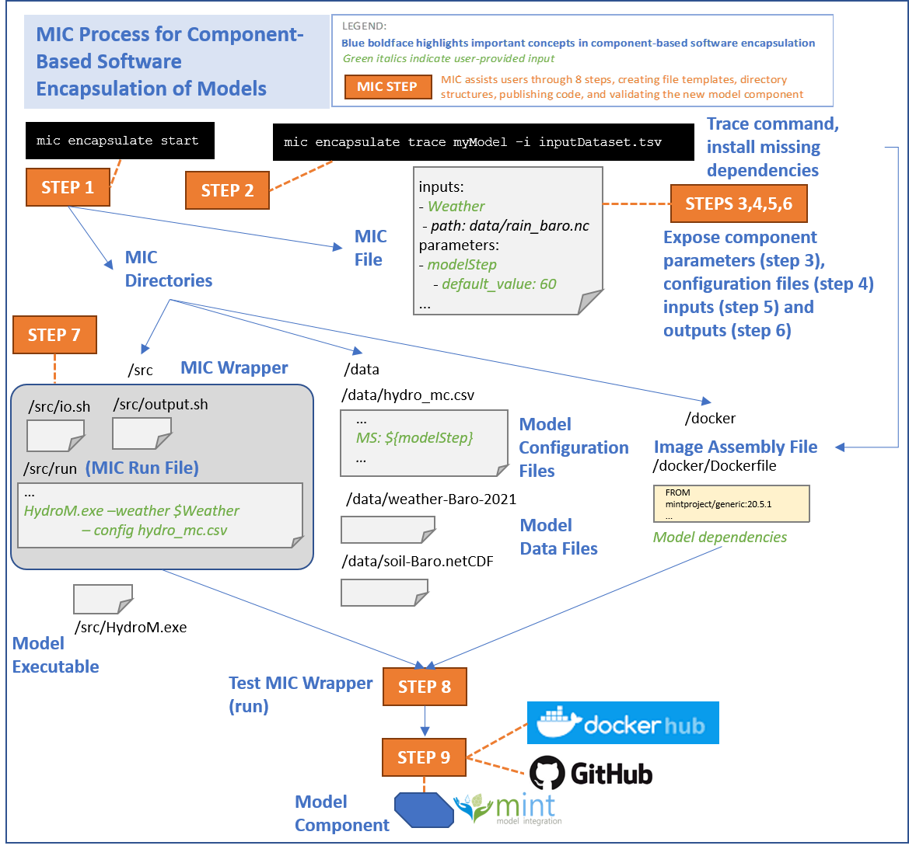

# Overview of the MIC process

MIC assists a user in encapsulating their software in 9 easy steps summarize in the figure below.



Below is a summary of the steps. This is not meant as a user guide. See the [detailed instructions](model_configuration/01-DockerGithub) for a step-by-step guide.

## The MIC process

### Step 1: Start a MIC encapsulation component
In this step, MIC will automatically detect the execution environment (e.g., python executables requiring a Python environment) and create a template *MIC file* that will be modified in subsequent steps with information about the model component.

**Expected outcomes of this step**: A folder (`mic`) with  a placeholder MIC file (`mic.yaml`) in that folder.

### Step 2: Trace your model execution
In this step, you will install any missing dependency needed to execute the software and trace its execution. The execution traces present the order of the statements that are touched during the execution of test cases.

**Expected outcome of this step**: The tracing process will cause the execution to be slower than normal. At the end of the process, a `.reprozip-trace` file will be added to the folder if the execution succeeded.

### Step 3: Select input parameters to expose
In this step, you will expose specific input parameters to your software component. You can expose as little or as many parameters as needed. It entirely depends on the application and who the expected end user of the component is. Note that it is possible to create different component of the same executable aimed at different audiences.

**Expected outcome of this step**: The MIC file will be automatically edited to include information about the input parameters that you specified for your component.

### Step 4: Pre-populate the software configuration files (optional)
Complex software packages (e.g. modeling software) often use configuration files to pass parameters to the executable rather than passing the parameters through a command line invocation. If this is the case, this additional step is needed to flag the input parameters in the config files that will be exposed to a user. Even if you are using a config file, step 3 is required.

**Expected results after completing this step**: MIC will update the MIC file with pointers to the configuration files that set the parameters that are inputs to the component.

### Step 5: Specify input files to expose
Although MIC will automatically detect most of the inputs your component used for execution, we need to determine which of these files should be exposed to a user (much like we did for the parameters).

**Expected outcome of this step**: The MIC file will be automatically edited to include information about the input files.

### Step 6: Specify outputs to expose
Although MIC will automatically detect most of the outputs your component generated after execution, we need to determine which of these outputs are relevant for a user.

**Expected outcome of this step**: The MIC file will be automatically edited to include information about the outputs.

### Step 7: Prepare MIC wrapper
In this step, MIC will create three subfolders (`data`, `src` and `docker`) in the mic folder and *MIC wrapper* that indicates how the component invocation from Step 2 corresponds to the functions implemented in your model software.

**Expected outcome of this step**: The MIC Wrapper will automatically set up three files (run, io.sh, and output.sh) that capture how the component has been run. They can be found in the /src folder of the MIC directory.

### Step 8: Run your model through the MIC wrapper
Use the wrapper generated in Step 7 to execute your model.

**Expected outcome of this step**: A successful test run and encapsulation of your software.

### Step 9: Upload the model component software and image
MIC will upload the MIC Wrapper and your software in the MINT storage server.  MIC will also upload the component image in DockerHub and upload your software in the MINT Model Catalog, which will make it accessible by others through MINT services and interfaces to be run in their own local hosts and servers. This will give them unique identifiers that represent the snapshot of the software that you wanted to encapsulate so that any future updates to your software or your software component can be distinct from each other.

**Expected results after completing this step**: Your model component wrapper will be uploaded to MINT server, and your model component image to DockerHub. Both will receive a tag and will be versioned, and will be archived so they are available to anyone anywhere.  MINT will have an entry for your component in the MINT Model Catalog, which will be accessible through your browser.  Anyone using [DAME](dame-cli.readthedocs.io/) can run your component with their own data.  Anyone using MINT can run your component with appropriate datasets available in MINT.


## Using MIC to Create Model Components

The `pkg` command  in MIC guides you through nine steps to create a model component that encapsulates your model code and makes it available so others can easily run it in their own local environments. To accomplish this, MIC relies on state-of-the-art virtualization tools (including Docker), software engineering best practices, and semantic reasoning for validation.

MIC creates: 1) a MIC Directory, 2) a MIC File, 3) a MIC Wrapper, 4) a component virtualization image, 5) archival versions of your model code, MIC directories and files, and image in the MINT Storage server  and DockerHub, and 6) a model component entry in the MINT Model Catalog.

Once you have MIC installed, you can type `mic pkg --help` to see the following message that lists all the steps:

```bash
Usage: mic pkg [OPTIONS] COMMAND [ARGS]...

  Command to pkg your model component

Options:
  --help  Show this message and exit.

Commands:
  start       Create a Linux environment to run your model. The working
              directory selected must contain all the files required for the
              execution of your model

  trace       Trace any command line and extract the information about your
              model execution

  parameters  Expose parameters in the mic.yaml file
  configs     Select configuration file(s) for your model (if applicable)
  inputs      Expose model inputs into the mic.yaml file
  outputs     Expose model outputs in the mic.yaml file
  wrapper     Generate the directory structure and commands required to run
              your model component using the information from the previous
              steps

  run         Run your model component with the MIC Wrapper generated in the
              previous step

  upload     Upload your code to DockerHub and your
              model component on the MINT Model Catalog.
```

You have to follow the commands in order to successfully upload your component. If you want to know more about a specific step, just do `mic pkg <stepName> --help`, where `<stepName>` represents one of the steps listed above (e.g., `trace`).
